# Comparing Anomaly Detection Methods for Medicare Provider Fraud

This project compares **unsupervised anomaly detection** and **supervised classification** methods for identifying potentially fraudulent Medicare providers from administrative claims data. The central question is practical: what can a payer detect in a **cold-start fraud setting**, before reliable confirmed fraud labels exist, and how much does performance improve once labels become available?

The analysis uses the Kaggle **Healthcare Provider Fraud Detection Analysis** dataset, which includes Medicare inpatient claims, outpatient claims, beneficiary information, and provider-level `PotentialFraud` labels. Claims are aggregated to the provider level because the fraud label is attached to providers, not individual claims.

## Headline findings

- **Best unsupervised model:** Autoencoder, with **ROC-AUC = 0.812** and **PR-AUC = 0.332** on the held-out provider test set.
- **Best supervised model by ROC-AUC:** Logistic Regression with SMOTE, with **ROC-AUC = 0.953** and **PR-AUC = 0.742**.
- **Best supervised precision/F1 tradeoff:** XGBoost, with **precision = 0.639**, **recall = 0.697**, and **F1 = 0.667**.
- **Classical density-based anomaly detection struggled:** Local Outlier Factor produced **ROC-AUC = 0.432**, worse than random ranking.
- **Financial impact:** at a top-10% alert budget and a $1,000 false-positive investigation cost, the Autoencoder produced an estimated **$68.7M net ROI on the test set**, scaled to approximately **$229M** over the full provider population. The best supervised model produced approximately **$101.8M net ROI on the test set**, scaled to approximately **$340M**.

The final recommendation is a staged deployment lifecycle:

> Start with unsupervised anomaly detection to prioritize investigations, convert investigation outcomes into labels, and then move toward supervised models as the labeled dataset matures.

---

## Repository contents

```text
.
├── README.md
├── STAT790_Comparing_anomaly_detection_methods_Data_Analysis_Francesco_Pecora.ipynb
├── STAT790_Comparing_anomaly_detection_methods_Unsupervised_Francesco_Pecora.ipynb
├── STAT790_Comparing_anomaly_detection_methods_Supervised_Francesco_Pecora.ipynb
└── images/
    ├── graph01_provider_fraud_scale.png
    ├── graph02_missing_value_rates.png
    ├── graph03_provider_feature_distributions.png
    ├── graph04_temporal_drift_replication.png
    ├── graph05_feature_correlation_heatmap.png
    ├── graph06_diagnosis_code_diversity.png
    ├── graph07_physician_network_features.png
    ├── graph08_smote_training_balance.png
    ├── graph09_unsupervised_anomaly_score_distributions.png
    ├── graph10_unsupervised_roc_pr_curves.png
    ├── graph11_alert_budget_precision_recall_sweep.png
    ├── graph12_supervised_roc_pr_curves.png
    ├── graph13_supervised_confusion_matrices.png
    ├── graph14_logistic_regression_feature_importance.png
    ├── graph15_random_forest_feature_importance.png
    ├── graph16_xgboost_feature_importance.png
    └── graph17_supervised_vs_unsupervised_auc.png
```

## Notebooks

| Notebook | Purpose |
|---|---|
| `STAT790_Comparing_anomaly_detection_methods_Data_Analysis_Francesco_Pecora.ipynb` | Loads the raw Kaggle files, assembles the claim-level dataset, performs exploratory data analysis, and motivates the provider-level feature design. |
| `STAT790_Comparing_anomaly_detection_methods_Unsupervised_Francesco_Pecora.ipynb` | Builds provider-level features and evaluates Isolation Forest, Local Outlier Factor, Autoencoder, and Variational Autoencoder models. |
| `STAT790_Comparing_anomaly_detection_methods_Supervised_Francesco_Pecora.ipynb` | Applies a matched train/test split, uses SMOTE on the training set only, and evaluates Logistic Regression, Random Forest, XGBoost, and a Neural Network. |

---

## Dataset

The dataset is modeled at the **provider level** because the fraud label is attached to providers, not individual claims. The raw claim files are joined with beneficiary information and provider labels, then aggregated into a 40-feature provider table.

| Object | Count / value | Interpretation |
|---|---:|---|
| Provider labels | 5,410 providers | Final modeling unit |
| PotentialFraud providers | 506 providers, 9.4% | Rare positive class |
| Beneficiary records | 138,556 | Patient demographics and chronic-condition fields |
| Inpatient claims | 40,474 | Hospital claims with length-of-stay features |
| Outpatient claims | 517,737 | Ambulatory claims |
| Combined claims | 558,211 | Claim-level table after stacking inpatient and outpatient claims |
| Train/test split | 3,787 / 1,623 providers | Stratified 70/30 split |
| Test fraud count | 152 providers | Held-out fraud providers |

Fraudulent providers are rare, but they have much larger reimbursement volume on average.

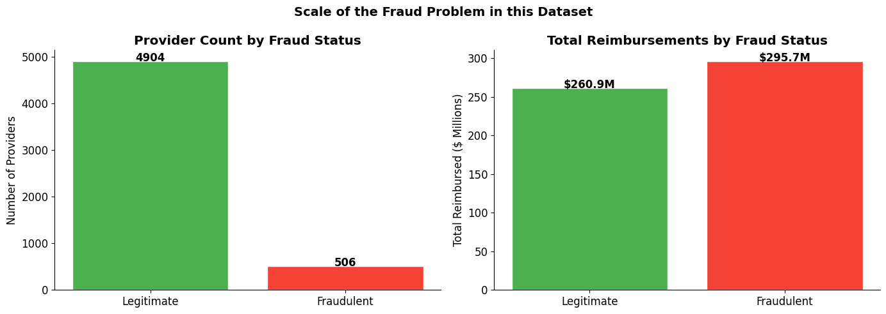

---

## Data challenge: high-dimensional mixed claims data

The raw claim data combines continuous dollar amounts, counts, dates, diagnosis codes, procedure codes, physician IDs, patient demographics, and chronic-condition indicators. A direct one-hot encoding of all diagnosis and procedure fields would create a very sparse feature space, so the project converts raw claims into interpretable provider-level behavioral summaries.

| Field | Unique values | Why it matters |
|---|---:|---|
| `ClmDiagnosisCode_1` | 10,450 | Primary diagnosis alone creates a very sparse space |
| `ClmDiagnosisCode_2` | 5,300 | Secondary diagnosis adds high-dimensional sparsity |
| `ClmDiagnosisCode_3` to `_5` | 3,970-4,756 | Additional diagnosis fields reinforce the mixed-data challenge |
| `ClmProcedureCode_1` | 1,117 | Procedure code variety is large but highly missing |
| `ClmProcedureCode_2` / `_3` | 300 / 154 | Procedure fields are sparse and episodic |
| `State` / `County` | 52 / 314 | Geography can proxy practice mix and patient pool |
| `Gender`, `Race`, `RenalDiseaseIndicator`, `ClaimType` | 2-4 | Lower-cardinality demographic and claim-type variables |

Missingness is structural. Procedure-code fields are missing for most claims because many outpatient claims do not contain reportable procedure codes in those slots.

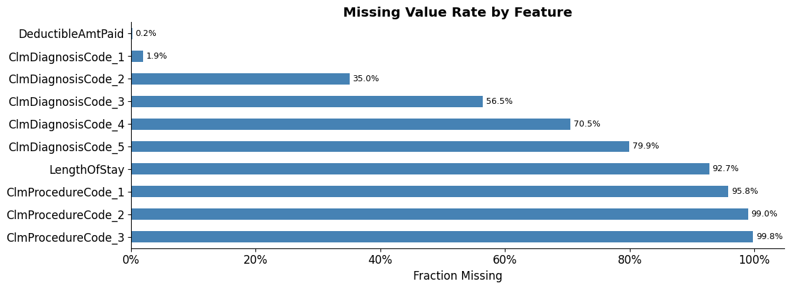

---

## Exploratory data analysis

The EDA shows that fraudulent providers are separated from legitimate providers most strongly by scale and intensity: total claims, total reimbursement, claim volume per patient, diagnosis diversity, and physician-network size.

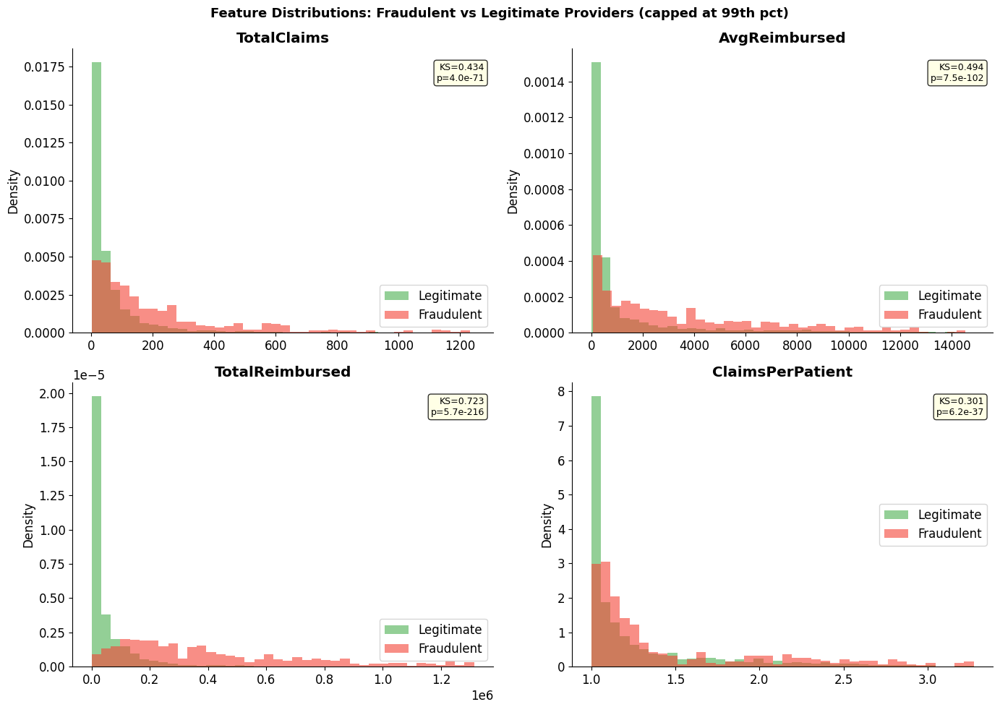

The project also replicates the baseline paper's idea of temporal drift: providers may become suspicious because their billing trajectory moves away from their own normal pattern, not just because they are global outliers.

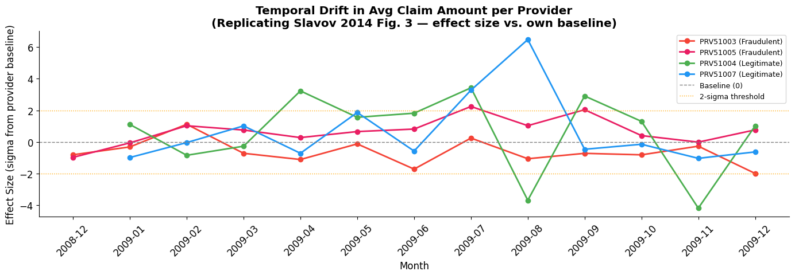

Feature correlations show that reimbursement volume, diagnosis diversity, patient count, and claim volume are among the strongest fraud-correlated signals.

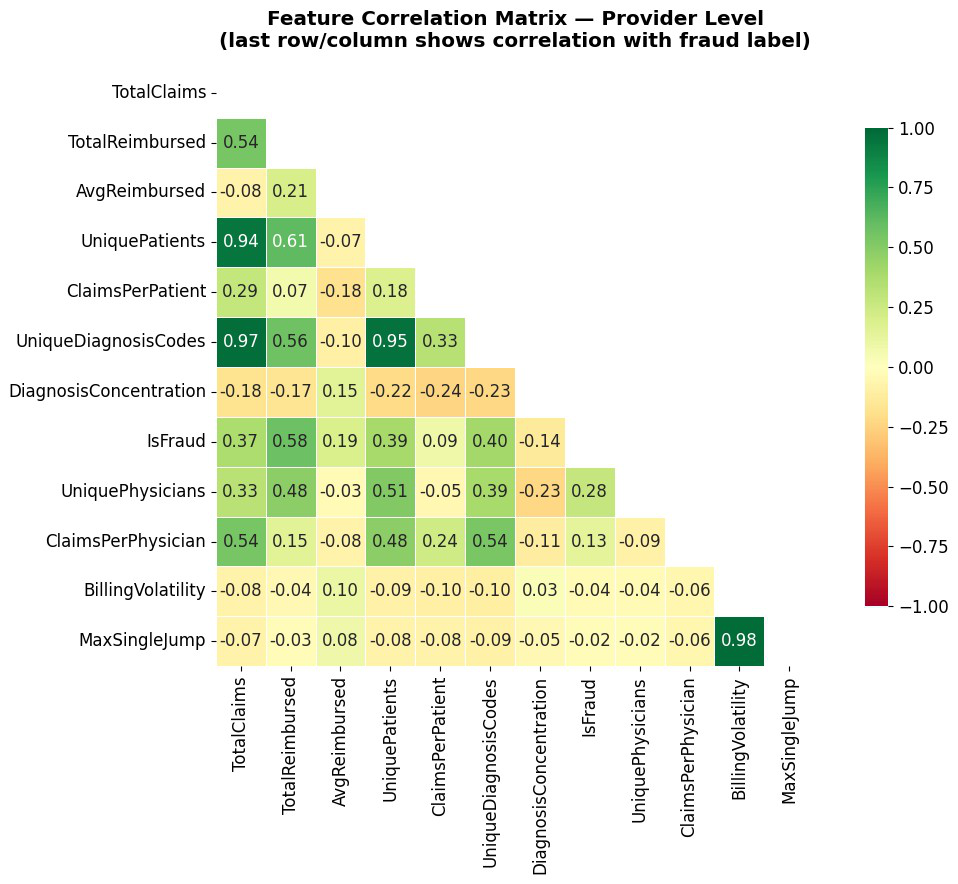

Diagnosis-code and physician-network summaries provide additional behavioral context beyond simple billing totals.

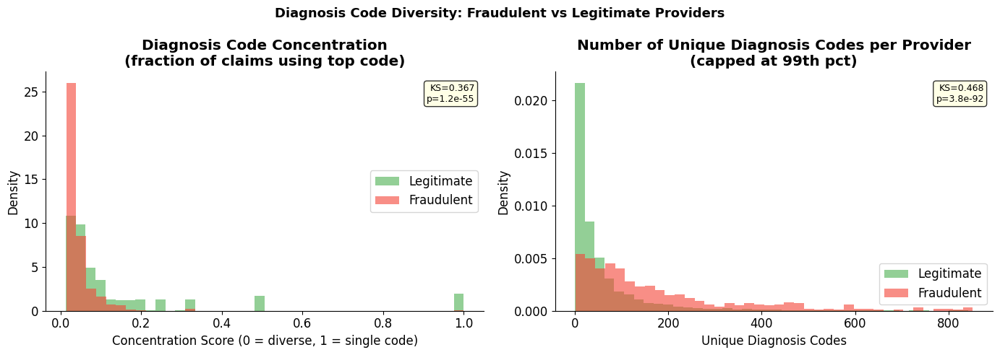

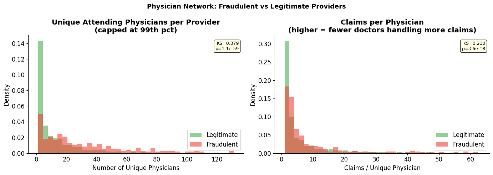

---

## Feature engineering

The final model input is a provider-level feature matrix with **40 numeric features** in five groups.

| Feature group | Representative features | Fraud intuition |
|---|---|---|
| Billing behavior | `TotalClaims`, `TotalReimbursed`, `AvgReimbursed`, `MedianReimbursed`, `MaxReimbursed`, `StdReimbursed`, `InpatientShare`, length-of-stay statistics | Fraudulent providers may bill more often, bill larger amounts, or have unusual inpatient intensity. |
| Diagnosis patterns | `UniqueDiagnosisCodes`, `DiagnosisConcentration`, `DiagnosisEntropy` | Suspicious providers may overuse certain codes or show atypical diagnosis diversity. |
| Physician network | `UniquePhysicians`, `ClaimsPerPhysician` | Provider-physician relationships may reveal unusually concentrated or unusually broad billing networks. |
| Demographics and clinical burden | `AvgAge`, `FemaleShare`, `RenalShare`, chronic-condition means | Patient-mix controls prevent high spending from automatically being treated as fraud. |
| Temporal volatility | `MonthsActive`, `BillingVolatility`, `MaxSingleJump`, `ClaimsVolatility`, `TotalReimbursedVolatility` | Sudden or unstable changes may indicate drift from normal provider behavior. |

Missing values and infinite values are replaced before modeling, and features are scaled with `StandardScaler` for methods sensitive to feature magnitude.

---

## Methodology

### Train/test split

All experiments use the same stratified 70/30 provider split and the same random seed. This makes the supervised and unsupervised results comparable on the same held-out providers.

### Unsupervised models

The unsupervised models represent the cold-start setting where confirmed fraud labels are not yet available for training.

- **Isolation Forest** with both a theoretical anomaly threshold and operational top-k alert budgets.
- **Local Outlier Factor**, included as a classical density-based baseline.
- **Autoencoder**, using reconstruction error as the anomaly score.
- **Variational Autoencoder**, using reconstruction-based anomaly scoring with KL regularization.

### Supervised models

The supervised pipeline applies **SMOTE only to the training set**, after the train/test split. The test set remains untouched.

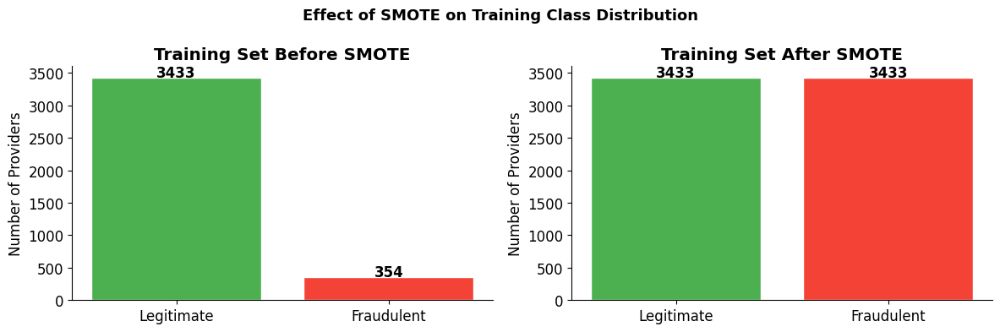

Models tested:

- Logistic Regression
- Random Forest
- XGBoost
- Neural Network

### Evaluation framework

The project reports ROC-AUC, PR-AUC, precision, recall, F1, bootstrap confidence intervals, and financial ROI under multiple investigation-cost assumptions.

The core financial formula is:

```text
Net ROI = recoverable reimbursement from true-positive flagged providers
          - false positives * investigation cost
```

---

## Results: unsupervised anomaly detection

| Model / threshold | Flagged | Precision | Recall | F1 | ROC-AUC 95% CI | PR-AUC 95% CI |
|---|---:|---:|---:|---:|---:|---:|
| Isolation Forest, theoretical score > 0.5 | 130 | 0.238 | 0.204 | 0.220 | 0.804 [0.773, 0.831] | 0.234 [0.190, 0.284] |
| Isolation Forest, top 10% | 163 | 0.245 | 0.263 | 0.254 | 0.804 [0.773, 0.831] | 0.234 [0.190, 0.284] |
| LOF, top 10% | 163 | 0.067 | 0.072 | 0.070 | 0.432 [0.380, 0.476] | 0.102 [0.074, 0.134] |
| Autoencoder, top 10% | 163 | 0.313 | 0.336 | 0.324 | 0.812 [0.783, 0.839] | 0.332 [0.265, 0.403] |
| VAE, top 10% | 163 | 0.190 | 0.204 | 0.197 | 0.627 [0.582, 0.671] | 0.203 [0.147, 0.260] |

The Autoencoder is the best cold-start model. Isolation Forest is close in ROC-AUC but weaker in PR-AUC. LOF fails in this mixed high-dimensional feature space, supporting the baseline concern that classical local-density methods are fragile for this type of healthcare data.

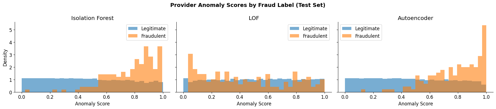

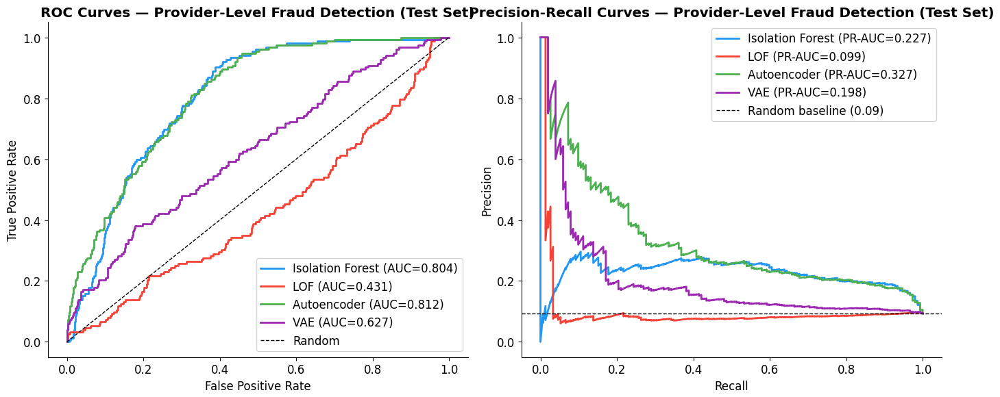

The alert-budget sweep shows the practical investigation tradeoff: a fraud unit can choose how many providers to review and see how precision and recall change as capacity expands.

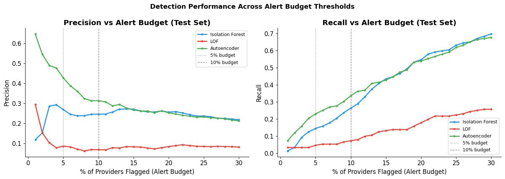

---

## Results: supervised classification

| Model | Precision | Recall | F1 | ROC-AUC 95% CI | PR-AUC |
|---|---:|---:|---:|---:|---:|
| Logistic Regression | 0.478 | 0.862 | 0.615 | 0.953 [0.936, 0.968] | 0.742 |
| Random Forest | 0.558 | 0.724 | 0.630 | 0.950 [0.930, 0.965] | 0.679 |
| XGBoost | 0.639 | 0.697 | 0.667 | 0.947 [0.928, 0.964] | 0.723 |
| Neural Network | 0.614 | 0.671 | 0.642 | 0.930 [0.908, 0.952] | 0.689 |

Supervised models perform substantially better once labels are available. Logistic Regression has the highest recall and ROC-AUC, while XGBoost gives the best precision/F1 tradeoff.

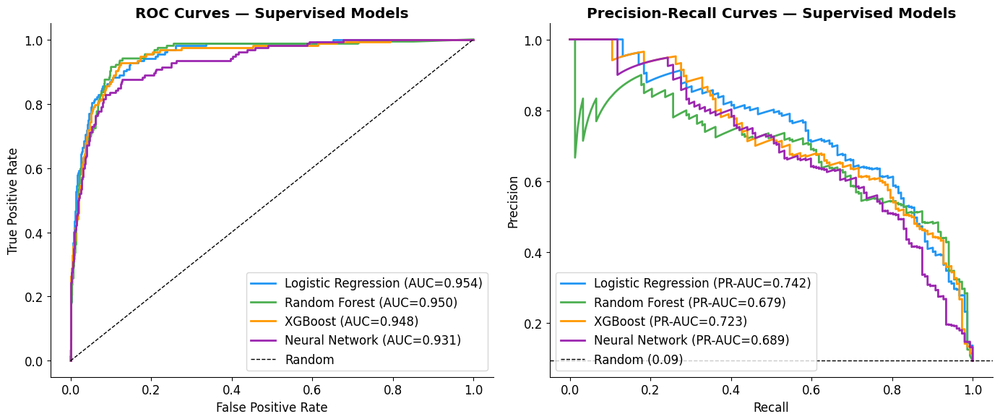

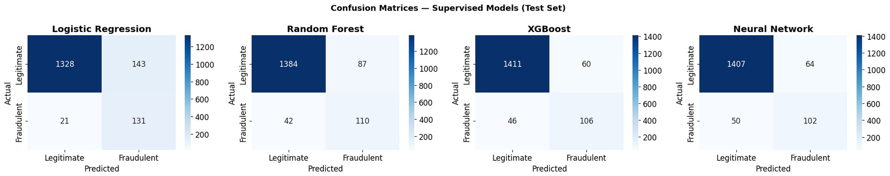

---

## Interpretability

Feature importance is one of the most useful outputs for real fraud operations because investigators need to understand why a provider was prioritized.

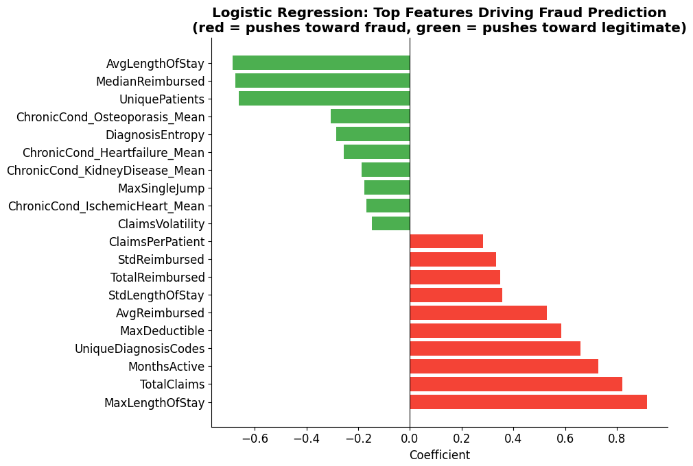

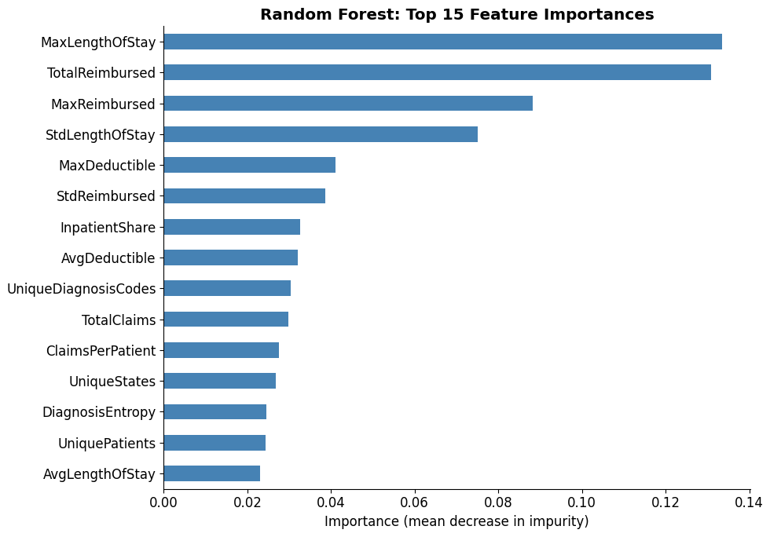

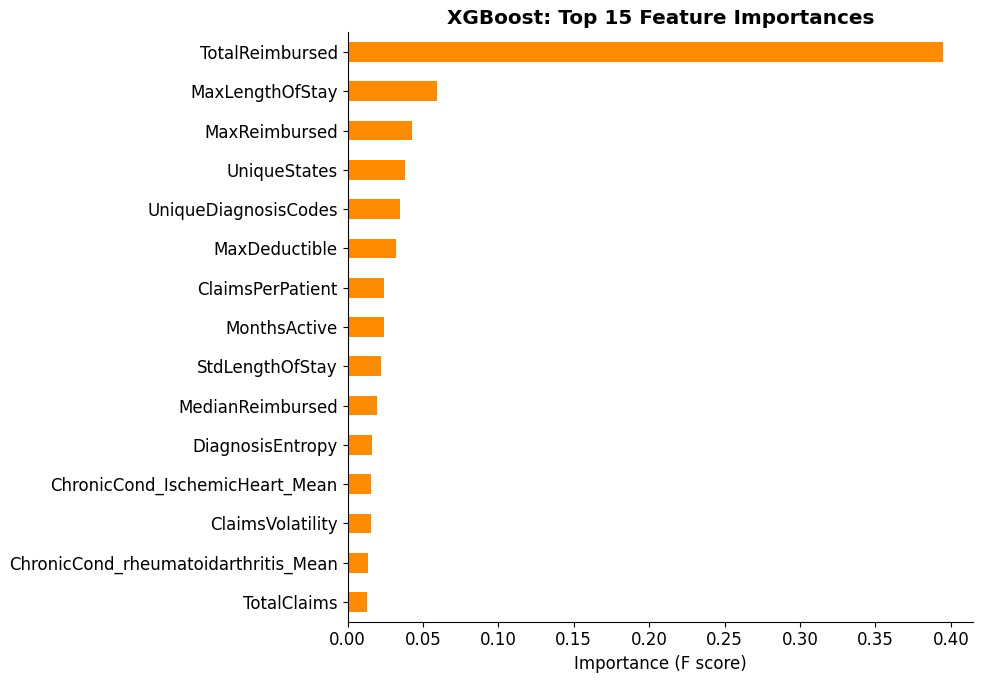

Across the supervised models, the most useful signals are reimbursement scale, claim volume, patient count, diagnosis diversity, length-of-stay behavior, and temporal volatility.

---

## Head-to-head comparison

The supervised and unsupervised models are evaluated on the same 1,623-provider test set. This makes the comparison a clean estimate of the value of fraud labels.

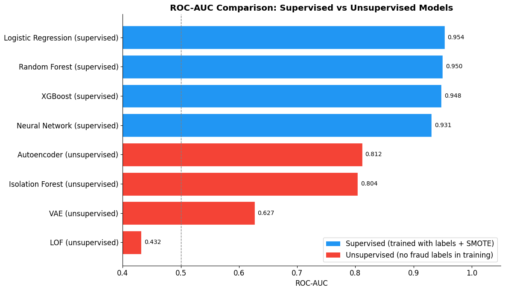

| Model family | Best model | ROC-AUC | Interpretation |
|---|---|---:|---|
| Unsupervised | Autoencoder | 0.812 | Strong cold-start ranking when labels are unavailable |
| Supervised | Logistic Regression | 0.953 | Best overall ranking once labels exist |
| Supervised | XGBoost | 0.947 | Best precision/F1 tradeoff for limited alert capacity |

The roughly 0.12-0.14 ROC-AUC improvement from unsupervised to supervised models quantifies the operational value of confirmed labels.

---

## Financial impact analysis

At a top-10% alert budget and a $1,000 false-positive investigation cost, the best unsupervised model is financially meaningful, but supervised models unlock substantially greater value.

| Family | Model | True positives | False positives | Recoverable test set | Net ROI test set | Scaled recovery |
|---|---|---:|---:|---:|---:|---:|
| Unsupervised | Autoencoder | 51 | 112 | $68.8M | $68.7M | ~$229M |
| Unsupervised | Isolation Forest | 40 | 123 | $56.1M | $56.0M | ~$187M |
| Unsupervised | VAE | 31 | 132 | $49.9M | $49.8M | ~$166M |
| Unsupervised | LOF | 11 | 152 | $19.5M | $19.4M | ~$65M |
| Supervised | Logistic Regression | 131 | 143 | $101.9M | $101.8M | ~$340M |
| Supervised | Random Forest | 110 | 87 | $97.2M | $97.1M | ~$324M |
| Supervised | XGBoost | 106 | 60 | $96.0M | $95.9M | ~$320M |
| Supervised | Neural Network | 102 | 64 | $93.8M | $93.8M | ~$313M |

The dominant factor is not investigation cost; it is detection accuracy. The reimbursement scale of true positives is large enough that false-positive investigation cost has relatively small impact compared with ranking quality.

---

## How to run

The notebooks were designed for a Python/Colab-style environment.

Install the main dependencies:

```bash
pip install numpy pandas matplotlib seaborn scipy scikit-learn imbalanced-learn xgboost tensorflow kagglehub
```

Recommended execution order:

```text
1. STAT790_Comparing_anomaly_detection_methods_Data_Analysis_Francesco_Pecora.ipynb
2. STAT790_Comparing_anomaly_detection_methods_Unsupervised_Francesco_Pecora.ipynb
3. STAT790_Comparing_anomaly_detection_methods_Supervised_Francesco_Pecora.ipynb
```

The notebooks download the Kaggle dataset using:

```python
import kagglehub
path = kagglehub.dataset_download("rohitrox/healthcare-provider-fraud-detection-analysis")
```

---

## Limitations

- The labels are `PotentialFraud` labels from a public dataset, not adjudicated criminal convictions.
- The financial estimates are best interpreted as potential recoverable exposure under a prioritization rule, not guaranteed legal recovery.
- The dataset covers one program and time period, so external validation would be required before operational deployment.
- SMOTE improves supervised training balance but cannot create entirely new fraud patterns that are absent from the original data.
- Unsupervised models are best for cold-start prioritization; supervised models are preferred once reliable labels accumulate.

---

## References

- Breunig, M. M., Kriegel, H.-P., Ng, R. T., & Sander, J. (2000). *LOF: Identifying density-based local outliers*.
- Centers for Medicare & Medicaid Services. (2025). *Fiscal Year 2025 Improper Payments Fact Sheet*.
- Chawla, N. V., Bowyer, K. W., Hall, L. O., & Kegelmeyer, W. P. (2002). *SMOTE: Synthetic Minority Over-sampling Technique*.
- Chen, T., & Guestrin, C. (2016). *XGBoost: A scalable tree boosting system*.
- Davis, J., & Goadrich, M. (2006). *The relationship between precision-recall and ROC curves*.
- Kaggle: *Healthcare Provider Fraud Detection Analysis* dataset.
- Kingma, D. P., & Welling, M. (2013). *Auto-Encoding Variational Bayes*.
- Liu, F. T., Ting, K. M., & Zhou, Z.-H. (2008). *Isolation Forest*.
- U.S. Government Accountability Office. (2024). *Medicare and Medicaid: Additional Actions Needed to Enhance Program Integrity and Save Billions (GAO-24-107487)*.
- Slavov, S. (2014). Assigned baseline paper on healthcare provider fraud/anomaly detection.
